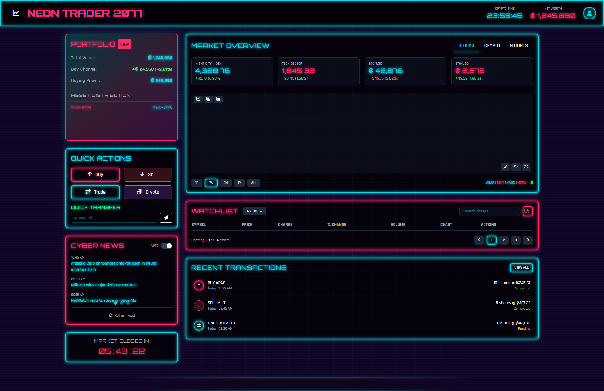
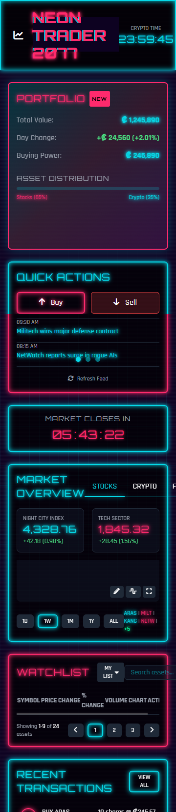

🧠 Futuristic Trading Dashboard (Cyberpunk-Inspired)

> Pure HTML, CSS & JavaScript se banaya gaya ek sleek trading dashboard with **dark neon UI** — inspired by futuristic and cyberpunk aesthetics. ⚡  
> Ideal for simulation apps, UI practice, ya demo projects!

---

🚀 Live Preview (Coming Soon)

🎥 TikTok Demo: [@talha_coder_5577](https://www.tiktok.com/@talha_coder_5577)  
📸 Instagram Reel: [@talhaaa.khann](https://www.instagram.com/talhaaa.khann/)  
🗂️ GitHub Profile: [@thetalha-dev](https://github.com/thetalha-dev)

---

🛠️ Tech Stack

- **HTML5** – Semantic layout
- **CSS3** – Dark mode, glassmorphism, neon shadows
- **JavaScript (Vanilla)** – For interactivity and dynamic elements

---

🎯 Features

✅ Dark neon cyberpunk UI  
✅ Live price cards / stat widgets  
✅ Glass effect panels  
✅ Responsive layout  
✅ Built for simulations or practice projects

---

📁 How to Use

1. Clone the repository:

   ```bash
   git clone https://github.com/thetalha-dev/futuristic-trading-dashboard.git

   ```

Open the folder and launch index.html in your browser
No build tools or setup needed!

📸 Screenshots

📂 Desktop View


📱 Mobile Layout


📢 Follow Me

TikTok: @talha_coder_5577

Instagram: @talhaaa.khann

GitHub: @thetalha-dev

🧾 License

This project is open-source under the MIT License.
Use it freely — credits appreciated! 💖

👨‍💻 Made with 💻 and ☕ by @thetalha-dev
