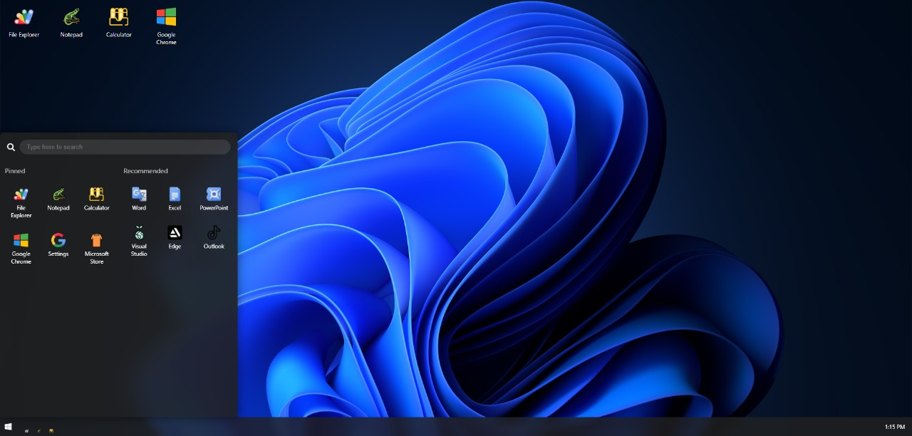
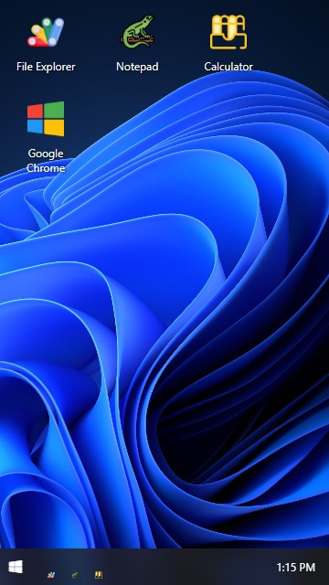

🪟 Windows 11 UI Clone (Built from Scratch)

"Thought it was a real Windows 11 screen? Nah bro, I built the whole UI from scratch using code only!" 😎

This is a fully responsive Windows 11 UI clone made purely with HTML, CSS, and JavaScript — no design tools, no screenshots, just 100% code! It replicates the smooth modern look of Windows 11 with a functional start menu, taskbar, and interactive UI elements.

🔥 Demo

🎥 TikTok Video: [Click to Watch](https://www.tiktok.com/@talha_coder_5577/video/7507700973805014279)
📱 Instagram Reel: [View on Instagram](https://www.instagram.com/reel/DKAUyGut3DM/?igsh=bGx6bGdrb2I0M2d6)

🛠️ Tech Stack

HTML5 – For structure

CSS3 – For layout, responsiveness, and design

JavaScript (Vanilla) – For interactivity (like the Start menu toggle etc.)

💻 Features

✅ Windows 11-style Taskbar

✅ Start Menu UI

✅ Hover and Click Interactions

✅ Responsive Layout (mobile-friendly)

✅ Clean and Modern Code Structure

🚀 How to Run Locally

Clone this repository:
git clone https://github.com/thetalha-dev/Windows-11-UI-Clone/

Open the folder and run index.html in any modern browser.

No additional setup required.

📸 Screenshots

📂 
📂 

📱 

🪟 Start Menu Preview

📢 Follow Me

👨‍💻 TikTok: @talha_coder_5577

📷 Instagram: @talhaaa.khann

🧾 License

This project is open source under the MIT License
Feel free to use and remix — credit is appreciated! 💖

Made with ❤️ by @thetalha-dev
